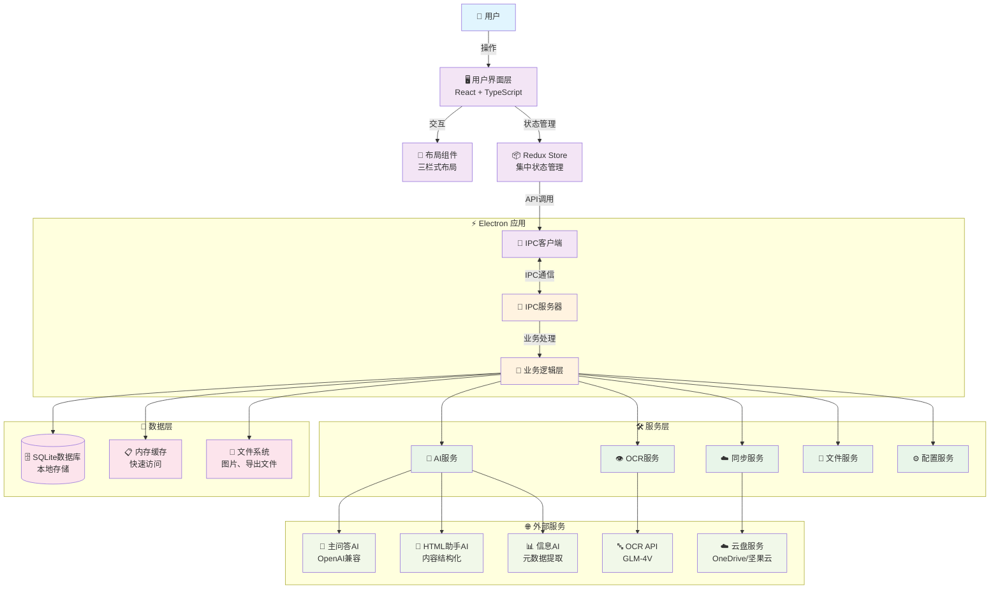
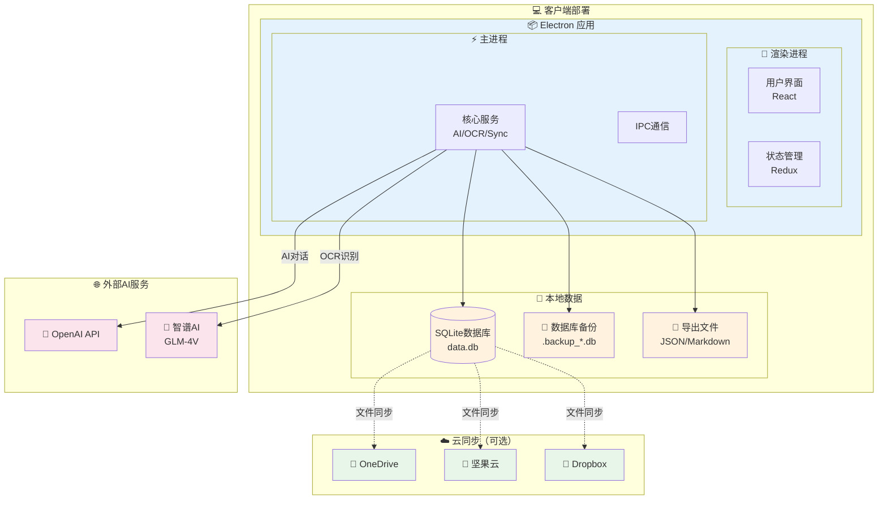
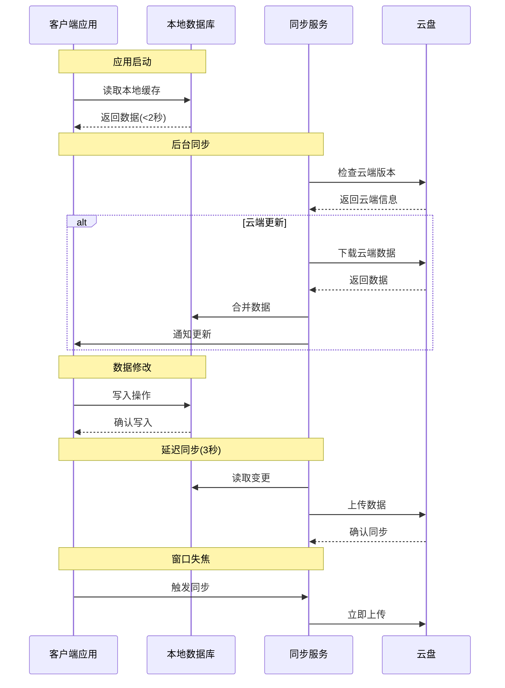
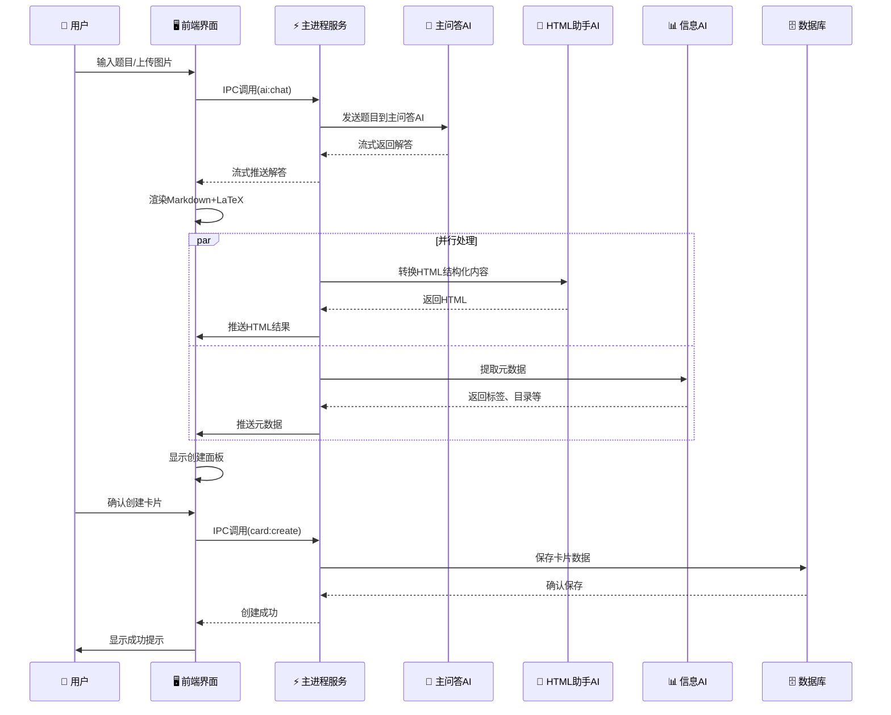
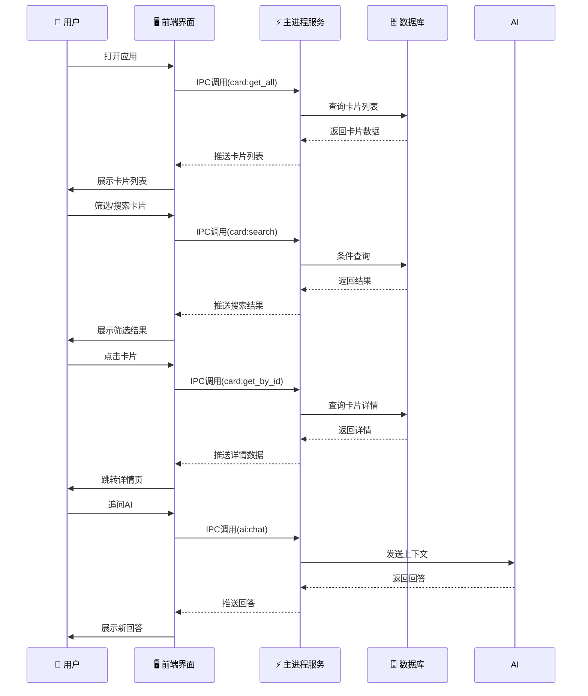
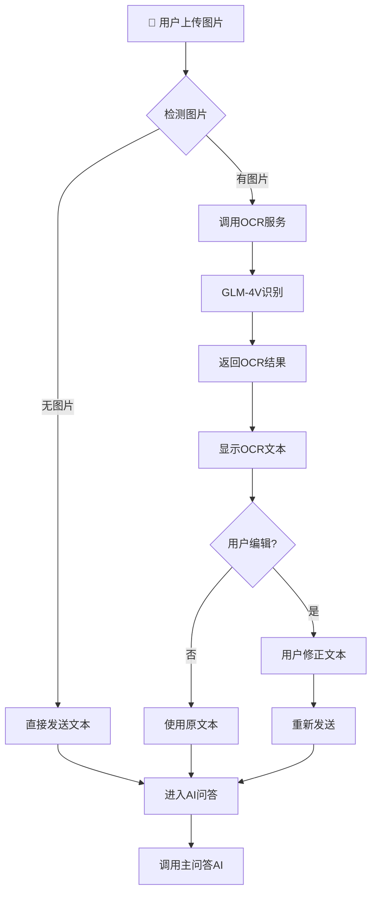
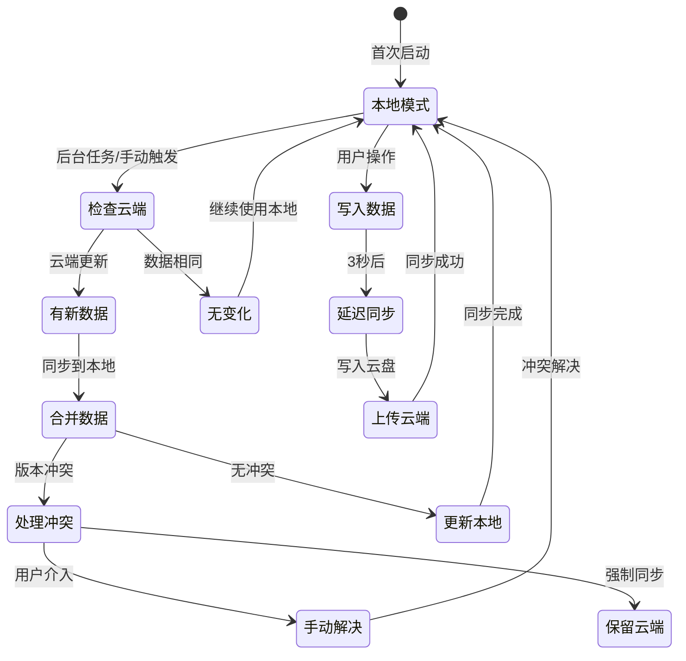

# 考研学习助手 - MVP 架构设计文档

**版本**: v1.0
**创建日期**: 2025-11-24
**项目名称**: 考研学习助手
**平台**: PC端桌面应用（Electron）

---

## 1. 系统整体架构

### 1.1 架构概述

考研学习助手采用现代化的桌面应用架构，结合Electron跨平台技术、AI模型服务和本地数据存储，构建一个高效、智能的考研学习工具。

**核心设计原则**：
- **解耦分层**：UI层、业务逻辑层、数据访问层清晰分离
- **模块化**：各功能模块独立开发、测试和维护
- **可扩展**：预留多设备同步、在线服务等扩展能力
- **高性能**：本地优先，快速响应
- **智能化**：集成多AI模型，提供智能化学习体验

### 1.2 架构视图

系统采用经典的四层架构模式：

```
┌─────────────────────────────────────────────────────────────┐
│                     Presentation Layer                      │
│                   (React + TypeScript)                      │
├─────────────────────────────────────────────────────────────┤
│                     Business Layer                          │
│                (IPC + State Management)                     │
├─────────────────────────────────────────────────────────────┤
│                     Service Layer                           │
│         (AI Service + OCR Service + File Service)          │
├─────────────────────────────────────────────────────────────┤
│                     Data Layer                              │
│              (SQLite + Local File System)                   │
└─────────────────────────────────────────────────────────────┘
```

### 1.3 技术栈选择

| 层级 | 技术选型 | 版本 | 选择理由 |
|------|----------|------|----------|
| **跨平台框架** | Electron | ^28.0.0 | 跨平台桌面应用开发成熟方案 |
| **前端框架** | React | ^18.2.0 | 成熟生态、丰富组件库、TypeScript支持 |
| **状态管理** | Redux Toolkit | ^2.0.0 | 预测性状态管理、DevTools支持 |
| **路由** | React Router | ^6.20.0 | 标准React路由方案 |
| **UI组件库** | Ant Design | ^5.12.0 | 企业级UI组件、丰富功能 |
| **数学公式渲染** | KaTeX | ^0.16.0 | 快速LaTeX渲染、适合数学公式 |
| **Markdown渲染** | markdown-it | ^14.0.0 | 轻量级、插件化 |
| **主进程语言** | Node.js | ^18.0.0 | Electron默认、异步I/O |
| **渲染进程语言** | TypeScript | ^5.3.0 | 类型安全、现代化开发 |
| **数据库** | SQLite | 3.43.0 | 嵌入式数据库、零配置 |
| **ORM** | Better-Sqlite3 | ^9.2.0 | 高性能同步SQLite操作 |
| **图像处理** | Sharp | ^0.33.0 | 高性能图像处理库 |
| **构建工具** | Vite | ^5.0.0 | 快速构建、HMR支持 |
| **包管理** | pnpm | ^8.10.0 | 高效包管理、节省磁盘空间 |
| **AI模型接口** | OpenAI API兼容接口 | - | 主问答AI、HTML助手AI、信息AI |
| **OCR服务** | GLM-4.5V API | - | 视觉模型OCR识别 |
| **云同步** | 文件系统监控 | - | 支持坚果云、OneDrive等云盘同步 |

---

## 2. 模块划分

### 2.1 主进程模块（Main Process）

主进程负责应用生命周期管理、系统集成和后端服务。

```
src/main/
├── app.ts                  # 应用入口、生命周期管理
├── mainWindow.ts           # 主窗口创建与管理
├── menu.ts                 # 应用菜单栏
├── ipcMain/                # IPC主通道
│   ├── cardHandler.ts      # 卡片CRUD操作
│   ├── aiHandler.ts        # AI服务调用
│   ├── ocrHandler.ts       # OCR处理
│   ├── syncHandler.ts      # 同步服务
│   └── settingHandler.ts   # 配置管理
├── services/               # 核心服务
│   ├── database.ts         # 数据库连接与操作
│   ├── aiService.ts        # AI服务封装
│   ├── ocrService.ts       # OCR服务封装
│   ├── syncService.ts      # 云同步服务
│   └── fileService.ts      # 文件操作服务
├── utils/                  # 工具库
│   ├── logger.ts           # 日志工具
│   ├── config.ts           # 配置管理
│   └── validator.ts        # 数据验证
└── preload.ts              # 预加载脚本
```

**核心职责**：
- 应用启动与关闭
- 主窗口创建与管理
- IPC通信处理
- 数据库操作
- AI/OCR服务调用
- 云同步服务
- 系统集成（菜单、通知、托盘）

### 2.2 渲染进程模块（Renderer Process）

渲染进程负责UI渲染和用户交互。

```
src/renderer/
├── components/             # UI组件
│   ├── Layout/             # 布局组件
│   │   ├── MainLayout.tsx  # 主布局（三栏）
│   │   ├── LeftPanel.tsx   # 左侧导航
│   │   ├── MiddlePanel.tsx # 中间列表
│   │   └── RightPanel.tsx  # 右侧详情
│   ├── Card/               # 卡片相关
│   │   ├── CardList.tsx    # 卡片列表
│   │   ├── CardItem.tsx    # 卡片项
│   │   ├── CardDetail.tsx  # 卡片详情
│   │   └── CreatePanel.tsx # 创建面板
│   ├── Chat/               # 对话相关
│   │   ├── ChatInput.tsx   # 输入组件
│   │   ├── ChatMessage.tsx # 消息气泡
│   │   ├── ChatArea.tsx    # 对话区域
│   │   └── TabView.tsx     # 标签页
│   ├── Setting/            # 设置页面
│   └── Common/             # 通用组件
├── pages/                  # 页面组件
│   ├── OverviewPage.tsx    # 总览页面
│   ├── DetailPage.tsx      # 详情页面
│   └── SettingPage.tsx     # 设置页面
├── store/                  # 状态管理
│   ├── index.ts            # Store配置
│   ├── slices/             # Redux Slice
│   │   ├── cardSlice.ts    # 卡片状态
│   │   ├── chatSlice.ts    # 对话状态
│   │   ├── settingSlice.ts # 设置状态
│   │   └── uiSlice.ts      # UI状态
│   └── api/                # RTK Query API
├── hooks/                  # 自定义Hook
│   ├── useIpc.ts           # IPC通信Hook
│   ├── useCards.ts         # 卡片操作Hook
│   └── useChat.ts          # 对话Hook
├── utils/                  # 工具函数
│   ├── rendererLogger.ts   # 日志工具
│   ├── formatter.ts        # 格式化工具
│   └── constants.ts        # 常量定义
└── types/                  # 类型定义
    ├── card.ts             # 卡片类型
    ├── chat.ts             # 对话类型
    └── api.ts              # API类型
```

**核心职责**：
- UI界面渲染
- 用户交互处理
- 状态管理
- 页面路由
- API调用

### 2.3 共享模块（Shared）

主进程和渲染进程共享的代码。

```
src/shared/
├── constants/              # 共享常量
│   ├── events.ts           # IPC事件名
│   ├── api.ts              # API接口定义
│   └── database.ts         # 数据库常量
├── types/                  # 共享类型
│   ├── card.ts             # 卡片数据类型
│   ├── chat.ts             # 对话数据类型
│   └── system.ts           # 系统数据类型
└── utils/                  # 共享工具
    ├── idGenerator.ts      # ID生成器
    ├── dateUtils.ts        # 日期工具
    └── encryption.ts       # 加密工具
```

---

## 3. 模块间交互方式

### 3.1 进程间通信（IPC）

系统采用Electron的IPC机制实现主进程和渲染进程之间的通信。

**通信模式**：
- **Request-Response**：渲染进程发送请求，主进程处理后返回结果
- **Event-Driven**：主进程主动推送事件到渲染进程（如实时同步状态）

**核心IPC事件**：

```typescript
// 卡片操作
IPC_EVENTS.CARD_GET_ALL = 'card:get_all'
IPC_EVENTS.CARD_GET_BY_ID = 'card:get_by_id'
IPC_EVENTS.CARD_CREATE = 'card:create'
IPC_EVENTS.CARD_UPDATE = 'card:update'
IPC_EVENTS.CARD_DELETE = 'card:delete'
IPC_EVENTS.CARD_SEARCH = 'card:search'

// AI服务
IPC_EVENTS.AI_CHAT = 'ai:chat'
IPC_EVENTS.AI_STREAM = 'ai:stream'
IPC_EVENTS.AI_HTML_CONVERT = 'ai:html_convert'
IPC_EVENTS.AI_INFO_EXTRACT = 'ai:info_extract'

// OCR服务
IPC_EVENTS.OCR_RECOGNIZE = 'ocr:recognize'

// 同步服务
IPC_EVENTS.SYNC_TRIGGER = 'sync:trigger'
IPC_EVENTS.SYNC_STATUS = 'sync:status'
IPC_EVENTS.SYNC_CONFLICT = 'sync:conflict'

// 设置管理
IPC_EVENTS.SETTING_GET = 'setting:get'
IPC_EVENTS.SETTING_SET = 'setting:set'
IPC_EVENTS.SETTING_RESET = 'setting:reset'
```

### 3.2 数据流架构

**自上而下的数据流**：
```
用户操作 → React组件 → Redux Store → IPC调用 → 主进程服务 → 数据库
```

**自下而上的数据流**：
```
数据库变更 → 主进程 → IPC通知 → Redux Store更新 → React组件重新渲染
```

### 3.3 状态管理

采用Redux Toolkit进行集中式状态管理，状态分为：

1. **卡片状态**（CardSlice）
   - 卡片列表
   - 选中卡片
   - 筛选条件
   - 排序规则

2. **对话状态**（ChatSlice）
   - 对话历史
   - 当前消息
   - 流式输出进度
   - 标签页状态

3. **设置状态**（SettingSlice）
   - AI提示词配置
   - 界面偏好
   - 同步设置
   - 用户配置

4. **UI状态**（UISlice）
   - 加载状态
   - 错误信息
   - 通知消息
   - 布局状态

---

## 4. 系统架构图

### 4.1 整体架构图



---

## 5. 部署架构图

### 5.1 单机部署架构

考研学习助手MVP采用本地部署模式，所有数据存储在本地SQLite数据库中。



### 5.2 数据同步架构



### 5.3 部署拓扑

```
┌─────────────────────────────────────────┐
│              Windows/macOS/Linux          │
│  ┌─────────────────────────────────────┐ │
│  │         客户端应用                     │ │
│  │  ┌──────────┐ ┌──────────────────┐  │ │
│  │  │渲染进程  │ │    主进程         │  │ │
│  │  │React UI  │ │  Node.js 服务     │  │ │
│  │  └──────────┘ └──────────────────┘  │ │
│  └─────────────────────────────────────┘ │
│                                         │
│  ┌──────────┐ ┌──────────┐ ┌──────────┐ │
│  │SQLite DB │ │  备份文件 │ │  导出文件 │ │
│  │data.db   │ │ .backup  │ │  JSON    │ │
│  └──────────┘ └──────────┘ └──────────┘ │
└─────────────────────────────────────────┘
                    │
                    │ 可选云同步
                    ▼
        ┌──────────────────────────┐
        │     云盘同步目录          │
        │   (OneDrive/坚果云)       │
        └──────────────────────────┘
```

---

## 6. 数据流图

### 6.1 AI问答与卡片创建流程



### 6.2 卡片浏览与查看流程



### 6.3 OCR处理流程



### 6.4 数据同步流程



---

## 7. 数据库设计

### 7.1 数据库架构

采用SQLite作为本地数据库，设计以下核心表：

```sql
-- 卡片表
CREATE TABLE cards (
    id TEXT PRIMARY KEY,
    user_id TEXT NOT NULL,
    question TEXT NOT NULL,
    answer_html TEXT NOT NULL,
    directory TEXT NOT NULL,
    tags TEXT NOT NULL, -- JSON数组
    created_at DATETIME DEFAULT CURRENT_TIMESTAMP,
    updated_at DATETIME DEFAULT CURRENT_TIMESTAMP,
    ai_conversation_history TEXT NOT NULL, -- JSON
    status TEXT DEFAULT 'new',
    next_review DATETIME,
    review_count INTEGER DEFAULT 0,
    difficulty INTEGER,
    sync_status TEXT DEFAULT 'synced',
    device_id TEXT,
    version INTEGER DEFAULT 1
);

-- 设置表
CREATE TABLE settings (
    key TEXT PRIMARY KEY,
    value TEXT NOT NULL, -- JSON
    updated_at DATETIME DEFAULT CURRENT_TIMESTAMP
);

-- 目录表（可选，预留）
CREATE TABLE directories (
    id TEXT PRIMARY KEY,
    name TEXT NOT NULL,
    parent_id TEXT,
    path TEXT NOT NULL,
    created_at DATETIME DEFAULT CURRENT_TIMESTAMP,
    updated_at DATETIME DEFAULT CURRENT_TIMESTAMP
);

-- 标签表（可选，预留）
CREATE TABLE tags (
    id TEXT PRIMARY KEY,
    name TEXT NOT NULL UNIQUE,
    usage_count INTEGER DEFAULT 0,
    created_at DATETIME DEFAULT CURRENT_TIMESTAMP
);
```

### 7.2 索引设计

```sql
-- 卡片表索引
CREATE INDEX idx_cards_user_id ON cards(user_id);
CREATE INDEX idx_cards_directory ON cards(directory);
CREATE INDEX idx_cards_tags ON cards(tags);
CREATE INDEX idx_cards_created_at ON cards(created_at);
CREATE INDEX idx_cards_sync_status ON cards(sync_status);

-- 目录表索引
CREATE INDEX idx_directories_parent_id ON directories(parent_id);
CREATE INDEX idx_directories_path ON directories(path);
```

---

## 8. 安全与性能

### 8.1 安全策略

1. **数据加密**
   - 数据库文件加密（预留）
   - 敏感配置加密存储

2. **输入验证**
   - XSS防护：用户输入内容转义
   - SQL注入防护：参数化查询
   - 文件上传验证：图片格式、大小限制

3. **权限控制**
   - 本地应用，无用户认证
   - 云同步权限依赖云盘服务

4. **数据备份**
   - 自动备份：每日备份
   - 版本保留：保留7天
   - 冲突检测：自动生成备份文件

### 8.2 性能优化

1. **启动优化**
   - 本地缓存：<2秒快速启动
   - 懒加载：按需加载页面
   - 预加载：预加载常用数据

2. **查询优化**
   - 分页查询：卡片列表分页加载
   - 索引优化：关键字段建立索引
   - 缓存机制：热点数据内存缓存

3. **UI优化**
   - 虚拟列表：大量卡片渲染
   - 防抖处理：搜索、筛选
   - 懒加载：图片、对话历史

4. **网络优化**
   - 请求合并：批量API调用
   - 重试机制：网络失败自动重试
   - 离线模式：无网络时继续使用

---

## 9. 扩展性设计

### 9.1 未来扩展方向

1. **多设备同步**
   - 当前：通过云盘文件同步
   - 未来：WebDAV API、云服务器同步

2. **在线服务**
   - 当前：完全本地应用
   - 未来：Web版本、SaaS服务

3. **团队协作**
   - 当前：个人使用
   - 未来：共享卡片、团队空间

4. **AI模型**
   - 当前：外部API调用
   - 未来：本地模型、私有化部署

### 9.2 架构演进路线

```
MVP → v1.1 → v1.2 → v2.0
本机 → 云同步 → 在线版 → 平台化
```

---

## 10. 总结

考研学习助手MVP采用现代化的桌面应用架构，具有以下特点：

### 10.1 优势

- **技术成熟**：Electron + React技术栈成熟稳定
- **开发效率**：组件化、模块化开发快速迭代
- **用户体验**：本地应用响应快、离线可用
- **扩展性强**：预留多设备、在线服务扩展能力

### 10.2 挑战

- **性能优化**：Electron应用内存占用需要优化
- **兼容性**：多平台兼容性需要充分测试
- **AI依赖**：依赖外部AI服务，成本和稳定性

### 10.3 关键成功要素

1. **核心功能完整**：AI问答、卡片管理闭环
2. **性能达标**：启动<2秒，操作流畅
3. **数据安全**：本地数据可靠存储
4. **持续迭代**：快速响应用户反馈

---

**文档版本**: v1.0
**最后更新**: 2025-11-24
**审核状态**: 待审核
